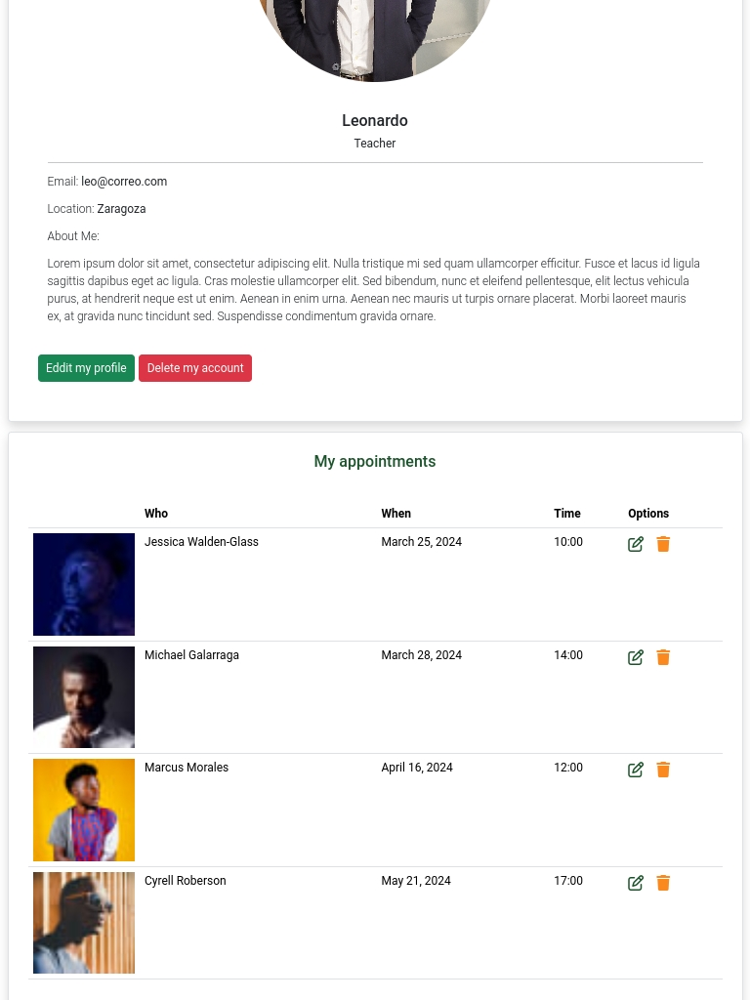

# Project 4 Full-Stack Toolkit
# Resubmision

* Fix typos and improve form validation (dates, inputs).
* Implement better sprint tracking and improve documentation in agile tools.
* Include detailed manual tests and clear objectives in test cases.
* Correct the deployment process mentioned in the documentation.
* Improve commit messages and data schema clarity.

# MindWell 

At MindWell, we understand that the journey to mental well-being can sometimes feel like a solitary road. That's why we're here to bridge the gap between individuals seeking support and the expert guidance they deserve. Our platform serves as a beacon of hope, connecting you with licensed therapists who can provide the guidance, support, and tools necessary to navigate life's challenges with resilience and clarity.

- [ External Goals](#external-users-goal)
- [ Owner's Goal](#site-owners-goal)
- [ Surface](#surface-colors--images-and-fonts)
- [ Features](#features)
- [ Other Features](#others-features)
- [ Technologies Used](#technologies-used)
- [ Testing](#testing)
- [ Preformance](#performance-testing)
- [ Deployment](#deployment)
- [ Credits](#credits)

### External user’s goal:

* Finding the right therapist
* connecting with licensed therapists
* Seek guidance, support, and tools necessary to navigate life.

### Site owner's goal:

* Connect User with licensed therapists
* Increase the trafic
* charge to the therapist small percentage for using our web to get clients
* help user to connect with professionals

## Surface (colors , images and fonts)
  * ### fonts
      * Arial,
      * Sedwick Ave Display

  * ### colors
    * --primario: #fa8920;
    * --primario-claro: rgba(250, 137, 32, .5);
    * --secundario: #1c532c;
    * --blanco: #FFF;
    * --negro: #000;
    
  * ### images are from.
    - [ Canva](https://www.canva.com/es_es/)
    -  [ Pexels](hhttps://www.pexels.com/es-es//)

##  Features

This website was made to help people to connect with therapist to help them with their mental health, emotional support or relationship issues.Therefore it has the following features:

* Navegation bar 
* Home page about MindWell
* Signup and login feature
* Profile page so the user can put info about them and appointments section so they can see, edit and delet theirs next appointments
* Edit and Delet account 
* Directory to shearch therapist
* Therapist profile so the user can see the experience and price of the therapist
* Schedule appointment
* Work with us form so if you're a therapist yo can load your profile in MindWell
* Abot page with the info about MindWell
* Contact form if you need info or leave feedback

 

## Existing Features

**Home page - About page - Contact page**

- Contain all the rellevant information about the website, things like how we work, the issues and possibles solutions, a list of therapist and contact forms.

**Signup - Login**

- The user can create an account or if already have one just logIn.

**User Profile Page**

- After the user creates their account he has to complete his personal info.
- User can add Name, Profession, description, email, location and some profile picture.
- In this page the user also can see theirs appointments. they can edit or delete them.

**Therapis directory**

- In the page "Look for a Therapist" the user have a full directory with therapist from everywhere. they can click any profile and see the info abou the selected therapist and in the same page make an appointment.

 

## Others Features

**Work with us page**

- If you're a therapist you can fil up our work with us form and you profile will be added to our directory 

**About and contact page**

- This pages contain info and contact form in case user needs to send specific messages to the owners

### Features Left to Implement

- Calendar so the user can see easely their appointments in a visual calendar

- The therapist can have a profile for them so they can update or delete their inf

- Email or message sistem so he Therapist can contact the clients through the MindWell website 

---
 

## Technologies used

### HTML5

- As a structure language.

### CSS

- As a style language.

### Java Scrpit

- As a css interactive language.

### Python - Django

- As a framework and backend 

### PostgredSQL - Elephant SQL

- As a DDBB 

### Font Awesome

- As an icon library for a social links and help button.

### Google fonts

- As a font resource.

### GitHub

- As a software hosting platform to keep project in a remote location.

### Git

- As a version-control system tracking.

### Miro

- As a wireframing tool.

### Image Manipulation Program [GIMP]

- As an image editor.

---
 

## Testing

I used Google Chrome web developer tools and Responsively app for testing and solving problems with responsiveness and style issues.

[Responsively App](https://responsively.app/) was very helpful the diferent screen sizes are listed below:

### Cell phones

- Galaxy S5 (360 - 640)
- Nokia N9 (480px - 854px)

### Tablets

- Ipad (768px - 1024px)
- Ipad Pro (1024 -1366)

### Desck top

- Nest Hub (1024px - 600px)
- Macbook Pro (1440px - 900px)

 

## Performance testing

I run [Lighthouse](https://developers.google.com/web/tools/lighthouse/) tool to check performance of the website.
I had to do couple of changes to improve performance. Screenshots are presented below:

I noticed that the scores of these tests change from time to time and also depend on external libraries.

I had some issues with bootstrap cdn loading time and some background images in the css, they are compressed but it's not improving the performance

### Validator Testing

- HTML
  - No errors were returned when passing through the official [W3C validator](https://validator.w3.org/nu/?doc=https%3A%2F%2Fmindwellproject4-c451517df623.herokuapp.com%2F)

- CSS
  - 17  errors were found when passing through the official [(Jigsaw) validator](https://jigsaw.w3.org/css-validator/validator?uri=https%3A%2F%2Fmindwellproject4-c451517df623.herokuapp.com%2F&profile=css3svg&usermedium=all&warning=1&vextwarning=&lang=es)
  this errors are because Bootstrap cdn so there is nothing that i can do, but if I give to de css validator my css files everything it's pass.

## Validator Testing
* PEP8
    - All clear, no errors found, I passed all models and forms

## Other Test

 * Every application has some unit test to verify that the forms are working correctly. 

###  Bugs (all the bugs are fixed)

* When we send forms the messages to display stay visibles in other pages if you are logIn   NO-FIXED 

* When the user try to edit their info it's no showing the last info, so the user have to add all the info again  FIXED 

 

# Deployment

The project was deployed on GitHub Pages. I used VsCode as a development environment where I commited all changes to git version control system.
I used push command in VsCode save changes into GitHub /Heroku.

 
Since Github does not support Python, the deployment of the app, the website is made by Heroku

To deploy a project I had to:

* Log in to Heroku, create a new app, add the Config Vars, and connect trought GitHUb.
* Choose the right repository and click deploy button.
>  Your site is published at https://mindwellproject4-c451517df623.herokuapp.com/

* Log in to GitHub and click on repository to deploy ([MindWell-project-4](https://github.com/richard9106/MindWell-project-4))
* select `Settings` and find GitHub Pages section at the very bottom of the page
* from source select `none` and then `Milestone-Projects` branch.

### To run localy:
 
* Log in to VScode account and link your repository to be open with VScode.

* Creating a virtual space in gitHub https://github.com/richard9106/MindWell-project-4 open the repository and then click on CODE green buttom and create a virtual space.

* once it has been created you can open it with VScode directly from your virtual space, you have to install  the requirements.txt using the command 

> pip install -r requirements.txt

* Last thing add  env.py   with the missing variables for the settings like in this case Cloudinary and ElephantSql data base info (User, Key, Apikey, etc.)

 

## Credits

* To complete this project I used Code Institute student template: [gitpod full template](https://github.com/Code-Institute-Org/gitpod-full-template)

* Ideas and knowledge library:

  > https://codepen.io/Sakilmurad/pen/GRNrvqX

  > https://www.youtube.com/watch?v=Kj7f76WdtqU&t=184s

  >https://www.youtube.com/watch?v=8m3W769YnEc

### Images:

* link images page [Canva](https://www.canva.com/)
* icons from [font Awesome](https://fontawesome.com/icons)
* Images Profiles [Pexel](https://www.pexels.com/es-es/buscar/recursos%20digitales/)

