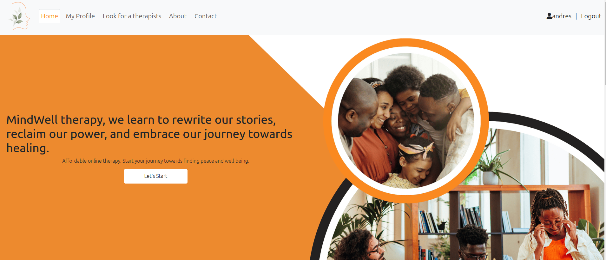

# Project 4 Full-Stack Toolkit
# Resubmision

* Fix typos and improve form validation (dates, inputs).
* Implement better sprint tracking and improve documentation in agile tools.
* Include detailed manual tests and clear objectives in test cases.
* Correct the deployment process mentioned in the documentation.
* Add data schema clarity.


# MindWell 

At MindWell, we understand that the journey to mental well-being can sometimes feel like a solitary road. That's why we're here to bridge the gap between individuals seeking support and the expert guidance they deserve. Our platform serves as a beacon of hope, connecting you with licensed therapists who can provide the guidance, support, and tools necessary to navigate life's challenges with resilience and clarity.


## CONTENTS
- [<span style="color:orange"> External Goals](#external-users-goal)
- [<span style="color:orange"> Owner's Goal](#site-owners-goal)
- [<span style="color:orange"> Surface](#surface-colors--images-and-fonts)
- [<span style="color:orange"> Features](#features)
- [<span style="color:orange"> Other Features](#others-features)
- [<span style="color:orange"> Technologies Used](#technologies-used)
- [<span style="color:orange"> Testing](#testing)
- [<span style="color:orange"> How to run a Test](#how-to-run-tests)
- [<span style="color:orange"> Preformance](#performance-testing)
- [<span style="color:orange"> Deployment](#deployment)
- [<span style="color:orange"> Credits](#credits)
- [<span style="color:orange"> Deployment ](#deployment)
- [<span style="color:orange"> Forking & Cloning Instruccions](#forking-and-cloning-instructions)
- [<span style="color:orange"> Security Settings](#security-settings)
- [<span style="color:orange"> User Story Prioritization](#agile-workflow-and-user-story-prioritization)
- [<span style="color:orange"> Credits](#credits)


### External user’s goal:

* Finding the right therapist
* connecting with licensed therapists
* Seek guidance, support, and tools necessary to navigate life.

### Site owner's goal:

* Connect User with licensed therapists
* Increase the trafic
* charge to the therapist small percentage for using our web to get clients
* help user to connect with professionals


 ### Logic
  The database schema and website logic was conceived and created using [Lucid](https://lucid.app/) as follows:

  Database Structure:


* [Back to Contents](#contents)


## Surface (colors , images and fonts)
  * ### fonts
      * Arial,
      * Sedwick Ave Display


  * ### colors
    * --primario: #fa8920;
    * --primario-claro: rgba(250, 137, 32, .5);
    * --secundario: #1c532c;
    * --blanco: #FFF;
    * --negro: #000;
    
  * ### images are from.
    - [<span style="color:Orange; font-size:20px;"> Canva](https://www.canva.com/es_es/)
    -  [<span style="color:Orange; font-size:20px;"> Pexels](hhttps://www.pexels.com/es-es//)

<span style="color:Orange;">

##  Features
</span>

This website was made to help people to connect with therapist to help them with their mental health, emotional support or relationship issues.Therefore it has the following features:

* Navegation bar 
* Home page about MindWell
* Signup and login feature
* Profile page so the user can put info about them and appointments section so they can see, edit and delet theirs next appointments
* Edit and Delet account 
* Directory to shearch therapist
* Therapist profile so the user can see the experience and price of the therapist
* Schedule appointment
* Work with us form so if you're a therapist yo can load your profile in MindWell
* Abot page with the info about MindWell
* Contact form if you need info or leave feedback

<span style="color:Orange;"> 

## Existing Features
</span>
**Home page - About page - Contact page**

- Contain all the rellevant information about the website, things like how we work, the issues and possibles solutions, a list of therapist and contact forms.




**Signup - Login**

- The user can create an account or if already have one just logIn.

<span style="display:flex; gap:10px">


</span>

**User Profile Page**

- After the user creates their account he has to complete his personal info.
- User can add Name, Profession, description, email, location and some profile picture.
- In this page the user also can see theirs appointments. they can edit or delete them.


**Therapis directory**

- In the page "Look for a Therapist" the user have a full directory with therapist from everywhere. they can click any profile and see the info abou the selected therapist and in the same page make an appointment.


<span style="color:Orange;"> 

## Others Features
</span>

**Work with us page**

- If you're a therapist you can fil up our work with us form and you profile will be added to our directory 


* [Back to Contents](#contents)


**About and contact page**

- This pages contain info and contact form in case user needs to send specific messages to the owners

<center>


</center>

### Features Left to Implement

- Calendar so the user can see easely their appointments in a visual calendar.

- The therapist can have a profile for them so they can update or delete their information.

- Email or message sistem so he Therapist can contact the clients through the MindWell website. 

---
<span style="color:Orange;"> 

* [Back to Contents](#contents)

## Technologies used
</span>

### HTML5

- As a structure language.

### CSS

- As a style language.

### Java Scrpit

- As a css interactive language.

### Python - Django

- As a framework and backend 

### PostgredSQL - Elephant SQL

- As a DDBB 

### Font Awesome

- As an icon library for a social links and help button.

### Google fonts

- As a font resource.

### GitHub

- As a software hosting platform to keep project in a remote location.

### Git

- As a version-control system tracking.

### Miro

- As a wireframing tool.

### Image Manipulation Program [GIMP]

- As an image editor.

---
<span style="color:Orange;"> 

## Testing
</span>
I used Google Chrome web developer tools and Responsively app for testing and solving problems with responsiveness and style issues.

[<span style="color:orange">Responsively App](https://responsively.app/) was very helpful the diferent screen sizes are listed below:

### Cell phones

- Galaxy S5 (360 - 640)
- Nokia N9 (480px - 854px)

### Tablets

- Ipad (768px - 1024px)
- Ipad Pro (1024 -1366)

### Desck top

- Nest Hub (1024px - 600px)
- Macbook Pro (1440px - 900px)

<span style="color:Orange;"> 

## Performance testing
</span>

I run [<span style="color:orange">Lighthouse](https://developers.google.com/web/tools/lighthouse/) tool to check performance of the website.
I had to do couple of changes to improve performance. Screenshots are presented below:


I noticed that the scores of these tests change from time to time and also depend on external libraries.

I had some issues with bootstrap cdn loading time and some background images in the css, they are compressed but it's not improving the performance

* [Back to Contents](#contents)

### Validator Testing

- HTML
  - No errors were returned when passing through the official [<span style="color:orange">W3C validator](https://validator.w3.org/nu/?doc=https%3A%2F%2Fmindwellproject4-c451517df623.herokuapp.com%2F)

- CSS
  - 17  errors were found when passing through the official [<span style="color:orange">(Jigsaw) validator](https://jigsaw.w3.org/css-validator/validator?uri=https%3A%2F%2Fmindwellproject4-c451517df623.herokuapp.com%2F&profile=css3svg&usermedium=all&warning=1&vextwarning=&lang=es)
  this errors are because Bootstrap cdn so there is nothing that i can do, but if I give to de css validator my css files everything it's pass.


## Validator Testing
* PEP8
    - All clear, no errors found, I passed all models and forms


## Other Test

 * Every application has some unit test to verify that the forms are working correctly. 

## How to Run Tests

To run tests in the Django project, follow these steps:

1. Ensure all dependencies are installed with the following command:
    ```bash
    pip install -r requirements.txt
    ```

2. Set up the necessary environment variables for your testing environment. If needed, add an `env.py` file with the specific configurations.

3. Run the tests using the following command:
    ```bash
    python manage.py test
    ```

4. If you want to check test coverage, install `coverage`:
    ```bash
    pip install coverage
    ```

   Then run the tests with coverage and generate the report:
    ```bash
    coverage run manage.py test
    coverage report
    ```

5. Optionally, check code style compliance using `flake8`:
    ```bash
    pip install flake8
    flake8
    ```

If you encounter issues while running the tests, make sure that migrations are applied correctly and all dependencies are up to date.


###  Bugs (all the bugs are fixed)

* When we send forms the messages to display stay visibles in other pages if you are logIn  <span style="color:red"> NO-FIXED </span>

* When the user try to edit their info it's no showing the last info, so the user have to add all the info again <span style="color:green"> FIXED </span>

* [Back to Contents](#contents)


# Deployment


  for a deployment, keep in mind that depending on the functionalities, some extra configuration may be missing. Very important is the configuration of variables in Heroku and the add-ons since without these activated you will not be able to see the project correctly

  Initially, Django was installed following this Code Institute [DRF Cheatsheet](https://docs.google.com/document/d/1LCLxWhmW_4VTE4GXsnHgmPUwSPKNT4KyMxSH8agbVqU/edit#heading=h.mpopj7v69qqn)

   1. Create a Cloudinary account and gather API key
   2. Create ElephantSQL database and gather API key
   3. Install Django
   4. Create project
   5. Install Cloudinary Storage
   6. Install Pillow (image processing)
   7. Update INSTALLED_APPs
       * all apps in the django project must be make migrations
       * python manage.py makemigrations
       * python manage.py migrate
       * to pass external data to the models if you need it.
          - create the fixture folder
          - add your file.json to the folder
          - python manage.py loaddata 'name.json' 
   8. Create env.py file
       * Add CLOUDINARY_KEY (from Cloudinary API key)
       * Add SECRET_KEY - (a unique password)
       * ADD DATABASE_URL - (postgres ElephantSQL API key)
       * DEBUG = True (if you have to push to heroku set False)
   9. Update settings.py
       * CLOUDINARY_STORAGE
       * Define Media Storage URL
       * Set DEFAULT_FILE_STORAGE
       * Set DATABASES
    
    

  ### Deployment to Heroku involved the following steps and changes:
   1. Set up DEBUG in settins.py to False
   2. install gunicorn ==22.0.0
   3. Create a Procfile (web: gunicorn core.wsgi:application) 
   4. Create a runtime.txt file and add the following: Python-3.12.3
   5. Terminate all servers.
       * Ensure DEBUG and DEV in env.py are commented out
       * python3 manage.py runserver
   6. Check project is displaying in the preview on port 8000 or gitpod
   7. Log into your Heroku account, create a new app, and access the dashboard for your application
   8. Go to Settings and open the Config Vars add all the Api keys in your env.py
       * Add CLOUDINARY_KEY (the Cloudinary API key)
       * Add SECRET_KEY - (the unique password)
       * Add DATABASE_URL - (postgres ElephantSQL API key)
   9. Ensure your application has an ALLOWED_HOST your '.herokuapp.com' - '.gitpod.io'
   10. Ensure in Resources in heroku dasboard change your dinos active.
   11. Go to the Deploy tab, connect the project to GitHub, and choose main branch to deploy
       * Click Deploy Branch (manually)
       * (Optional) Select Enable Automatic Deploys


* [Back to Contents](#contents)

## FORKING AND CLONING INSTRUCTIONS
You can create a copy of a GitHub Repository without affecting the original by forking or cloning it.

### Here's a step-by-step guide to forking:
Forking is often used for proposing changes or using the project as a starting point for your own idea. Forking will apear on your GitHub profile.
1. Log into GitHub or sign up for an account.
2. Go to the [Mind Well Repository](https://github.com/richard9106/MindWell-project-4)
3. Click "Fork" on the right side of the repository's page to create a copy in your own repository.

### Here's a step-by-step guide to cloning:
Cloning is often used for experimenting locally.  It will not show up on your GitHub profile.
1. Go to the [Mind Well Repository](https://github.com/richard9106/MindWell-project-4)
2. Click the green code button, then the arrow, and select the "clone by https" option to copy the URL.
3. Open your preferred code editor and navigate to the directory where you want to clone the repository.
4. Type 'git clone', paste the copied URL, and press enter. The repository will then be cloned to your machine.

* [Back to Contents](#contents)

## SECURITY SETTINGS
The following precautions were taken regarding the security of the site:
1. An env.py was created at the start of the project, and added to .gitignore, to contain the following settings:
   - CLOUDINARY_URL
   - SECRET_KEY
   - DATABASE_URL
2. These values were added to the Config Vars section of Heroku's Settings page.
3. Heroku is configured with 2FA


## Agile Workflow and User Story Prioritization

Our project follows an agile methodology using [Agile Tool Name] to manage and prioritize user stories. We categorize stories into high, medium, and low priority based on user needs and business goals.

### Prioritization Process
- **High priority** stories, such as critical features, are implemented first within each sprint.
- **Medium priority** stories include enhancements and secondary features.
- **Low priority** stories are nice-to-have features and are implemented after core functionality.

Each user story includes:
- A clear description of the feature.
- Criteria of acceptance to ensure successful implementation.
- Estimations of the effort required for completion.

 Go to the [Mind Well Repository project user stories](https://github.com/users/richard9106/projects/8/views/1?layout=table&visibleFields=%5B%22Title%22%2C%22Assignees%22%2C%22Status%22%2C%22Labels%22%5D)

### Sprint Planning and Execution
During each sprint, high-priority user stories are selected and tracked using [Agile Tool Name]. We use labels and color-coding to indicate the priority level and current status of each task (e.g., "To Do", "In Progress", "Done").

Regular retrospectives help us ensure continuous improvement in both implementation and prioritization.


## Credits

</span>

* To complete this project I used Code Institute student template: [<span style="color:orange">gitpod full template](https://github.com/Code-Institute-Org/gitpod-full-template)

* Ideas and knowledge library:

  > https://codepen.io/Sakilmurad/pen/GRNrvqX

  > https://www.youtube.com/watch?v=Kj7f76WdtqU&t=184s

  >https://www.youtube.com/watch?v=8m3W769YnEc


### Images:

* link images page [<span style="color:orange">Canva](https://www.canva.com/)
* icons from [<span style="color:orange">font Awesome](https://fontawesome.com/icons)
* Images Profiles [<span style="color:orange">Pexel](https://www.pexels.com/es-es/buscar/recursos%20digitales/)


